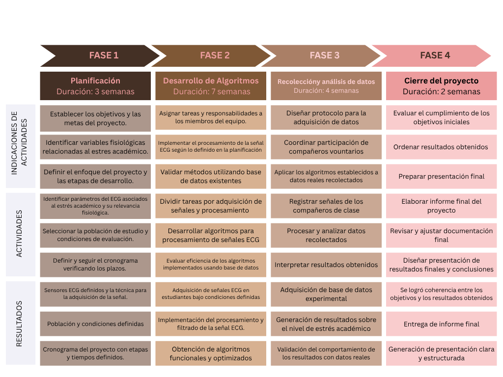

# Introducción
En el Perú, se estima que la población universitaria supera los 1.3 millones de estudiantes, quienes están expuestos a diversas exigencias académicas como evaluaciones constantes, sobrecarga de tareas y presión por el rendimiento. Estas condiciones favorecen la aparición de estrés, particularmente el estrés cognitivo, el cual puede afectar tanto el bienestar emocional como el desempeño académico.[1]
Sin embargo, al momento de poder evaluar el estrés en estudiantes, la mayoría suele basarse en métodos subjetivos como encuestas o autopercepción, lo que limita la precisión de los resultados, ya que estos mismos dificultan su monitoreo en tiempo real o bajo las circunstancias que se puedan encontrar. Bajo esta circunstancia, surge la necesidad de contar con herramientas objetivas que permitan medir el estrés de manera continua y no invasiva.
Es así que el análisis de bioseñales fisiológicas representa una alternativa prometedora, ya que estas reflejan cambios en el organismo asociados a la activación del sistema nervioso autónomo ante situaciones de estrés. Entre las principales bioseñales utilizadas se encuentran el electrocardiograma (ECG), el electroencefalograma (EEG), la actividad electrodérmica (EDA), la respiración, la electromiografía (EMG), entre otras, que se puede seleccionar dependiendo del tipo de estrés a estudiar. Dentro de estas señales, el ECG es una de las más empleadas, la cuál considera un aumento de la frecuencia cardíaca a mayores niveles de estrés. El EEG por su parte analiza bandas de frecuencia alfa, beta, gamma, delta y theta, que varían por el estrés, así también la EDA indica la conductancia eléctrica de la piel, aumentando con el estrés, otra señal es la respiración que al ser más rápida indica mayores niveles de estrés.[2]
Particularmente, el electrocardiograma permite estudiar la variabilidad de la frecuencia cardiaca (HRV), un indicador ampliamente utilizado para estudiar la respuesta fisiológica ante estímulos de estrés.[3] La HRV refleja el balance entre las ramas simpática y parasimpática por lo que es confiable para la detección de estados de estrés.
Para poder adquirir bioseñales en entornos cotidianos y facilitar el monitoreo continuo de parámetros fisiológicos, se ha podido visualizar el uso de wearables. Junto a ello, se tiene  desarrollo de técnicas de Machine Learning, en la cual se han podido emplear diferentes patrones complejos en datos fisiológicos y clasificar estados como el estrés de forma automática a tiempo real.
En este contexto, el presente proyecto propone el desarrollo de un sistema wearable basado en EKG que, mediante el análisis de la HRV y el uso de técnicas de Machine Learning, permite detectar y clasificar niveles de estrés cognitivo en estudiantes universitarios de forma objetiva y en tiempo real. Adicionalmente de una aplicación donde se mostraran estos resultados y junto a ello un monitoreo de las actividades que realiza.

# Problemática
El estrés académico es una de las condiciones en la cual se encuentran sometidos la mayoría de universitarios, ya sea por evaluaciones constantes, sobrecarga de tareas, alta exigencia y plazos ajustados. Este tipo de estrés cognitivo, se asocia a alteraciones en el sistema nervioso autónomo, que genera a su vez cambios autonómicos medibles como el electrocardiograma ( EKG), el cual puede cuantificarse mediante la variabilidad de la frecuencia cardiaca (HRV) no obstante, la evaluación del estrés suele basarse en métodos subjetivos como encuestas o escalas de autopercepción que limitan su monitoreo. 
El EEG, aunque permite medir directamente la actividad cerebral, requiere configuraciones más complejas y es altamente sensible a artefactos por movimiento, lo que limita su uso en entornos cotidianos. Por otro lado, la EDA, si bien es fácil de adquirir, refleja únicamente la actividad del sistema nervioso simpático y puede verse afectada por factores externos como la temperatura o la sudoración. En este contexto, el ECG destaca por permitir el análisis de la variabilidad de la frecuencia cardíaca (HRV), un indicador robusto del balance entre el sistema nervioso simpático y parasimpático. Además, su adquisición es viable mediante dispositivos wearables de una sola derivación, lo que facilita su uso continuo y no invasivo. Por estas razones, el ECG representa una alternativa adecuada para la detección objetiva y en tiempo real del estrés en estudiantes universitarios.

# Propuesta de solución
Se propone el desarrollo de un sistema wearable portátil para la detección y monitoreo del estrés cognitivo en estudiantes universitarios, enfocado en la adquisición de señales de electrocardiograma(ECG) de una sola derivación  y el análisis de la variabilidad de la frecuencia cardiaca(HRV), además haciendo uso de técnicas de Machine Learning. A partir de la señal cardiaca obtenida, se busca realizar el procesamiento necesario para obtener parámetros como la HRV, el RMSSD y la relación LF/HF, estas variables reflejan la actividad del sistema nervioso autónomo ante situaciones de estrés, lo que permitirá estimar el nivel de estrés del usuario. Asimismo, el sistema estará acompañado de una aplicación que permita visualizar los resultados en tiempo real y alertar al usuario ante incrementos en sus niveles de estrés.

# Plan de trabajo

## Referencias
[1] EPG Universidad Continental, “Educación universitaria en el Perú: situación actual y perspectivas,” Ucontinental.edu.pe, Feb. 29, 2024. https://blogposgrado.ucontinental.edu.pe/educacion-universitaria-peru-situacion-actual-perspectivas#:~:text=De%20los%20m%C3%A1s%20de%201%20'374%2C000%20estudiantes,en%20situaci%C3%B3n%20de%20pobreza%20o%20pobreza%20extrema.

[2] C. Chatzaki and M. Tsiknakis, “An Overview of Stress Analysis Based on Physiological Signals: Systematic Review of Open Datasets and Current Trends,” Sensors, vol. 25, no. 23, p. 7108, Nov. 2025, doi: https://doi.org/10.3390/s25237108.

[3]“Checking your browser - reCAPTCHA,” Translate.goog, 2024. https://pmc-ncbi-nlm-nih-gov.translate.goog/articles/PMC8407658/?_x_tr_sl=en&_x_tr_tl=es&_x_tr_hl=es&_x_tr_pto=tc.
