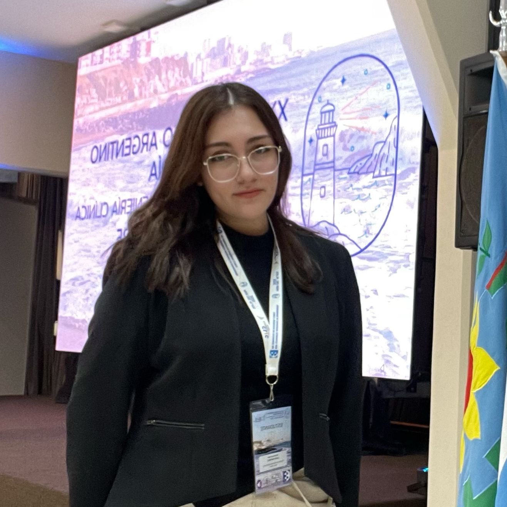
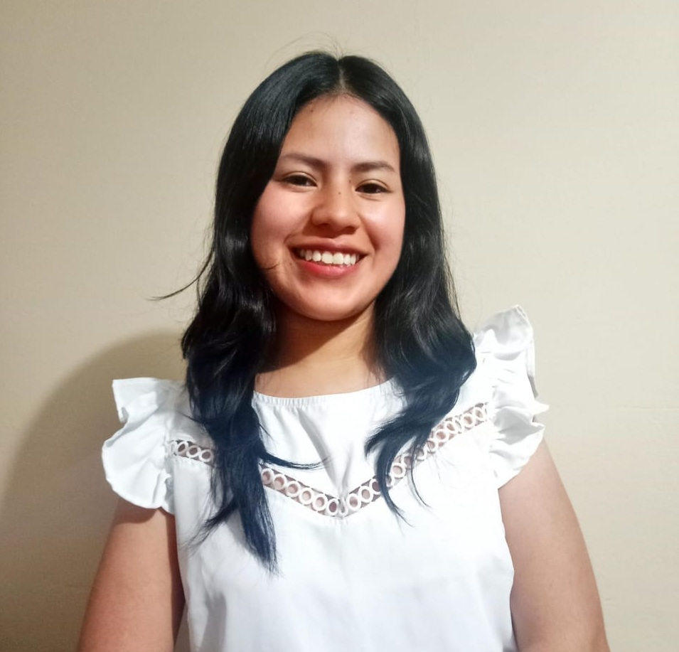
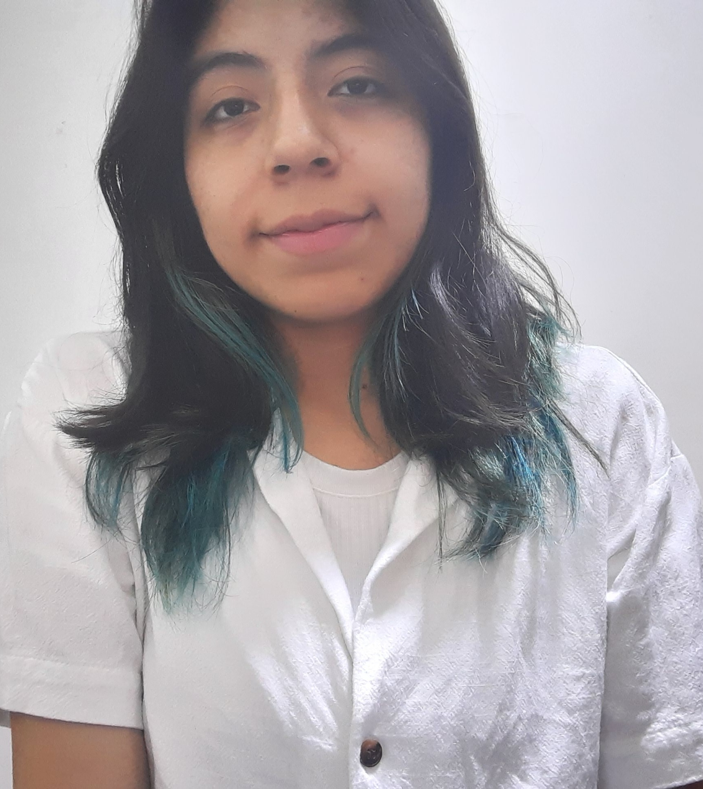
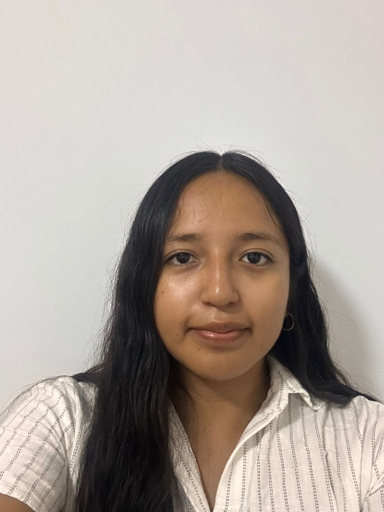

# Introducción a Señales Biomédicas 2025-II  
✨Repositorio del Grupo Chikorita✨  

## Introducción: 📚  

Este repositorio contiene el trabajo desarrollado por el grupo **Chikorita** en el curso *Introducción a Señales Biomédicas 2026-I*. Aquí presentaremos los avances y entregables respectivos de cada laboratorio y proyecto del curso.  

Como equipo, buscamos aprender y aplicar conceptos clave de adquisición, procesamiento y análisis de bioseñales, integrando la teoría con la práctica. Todo esto dentro de un entorno colaborativo que fomente el trabajo en equipo y el aprendizaje continuo en el área de la Ingeniería Biomédica.

## Objetivo: 🎯  

Nuestro objetivo es contribuir al desarrollo de soluciones tecnológicas aplicadas a la salud, mediante el análisis de señales biomédicas. En particular, buscamos diseñar un sistema que permita detectar niveles de estrés cognitivo en estudiantes universitarios utilizando bioseñales fisiológicas y técnicas de aprendizaje automático.  

## Integrantes: 👥  

| Foto | Nombre | Presentación | Contacto |
|------|--------|-------------|----------|
|  | **Violeta Vilcapoma Torres** |Estudiante de octavo ciclo de ingeniería biomédica|violeta.vilcapoma@upch.pe |
|  | **Ximena Capa Ramirez** | Estudiante de décimo ciclo de Ingeniería Biomédica. | ximena.capa@upch.pe |
| | **Anghely Alvarado Rosales** | Estudiante de séptimo ciclo de la carrera de Ingeniería Biomédica. | anghely.alvarado@upch.pe | 
|  | **Noely Quiroz Rojas** | Estudiante de séptimo ciclo de la carrera de Ingeniería Biomédica. Tengo un especial interés en el campo de la biomecánica y la rehabilitación. | noely.quiroz@upch.pe |
|  | **Carla Fermin Jimenez** | Estudiante de séptimo ciclo de la carrera de Ingeniería Biomédica con especial interés en dispositivos médicos. | carla.fermin@upch.pe |

## Docentes 👨‍🏫  

- **Moises Stevend Meza Rodriguez**  
- **Jose Alonso Caceres Del Aguila**  
